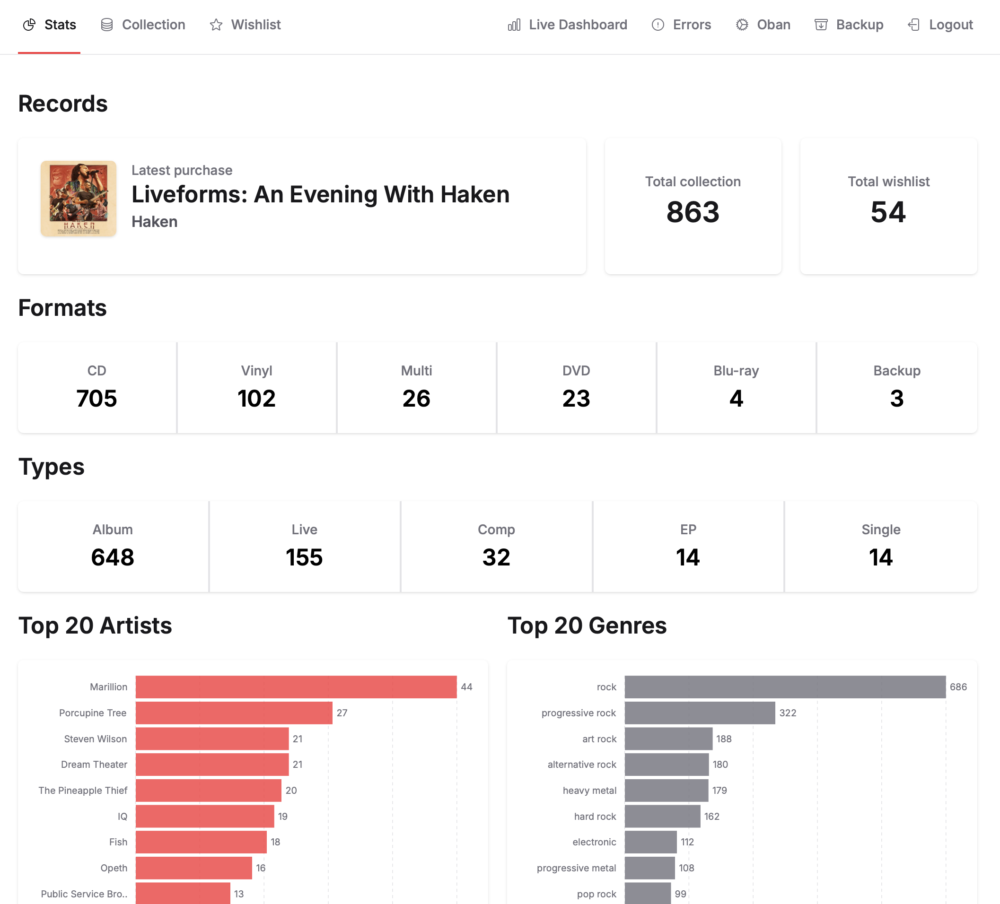
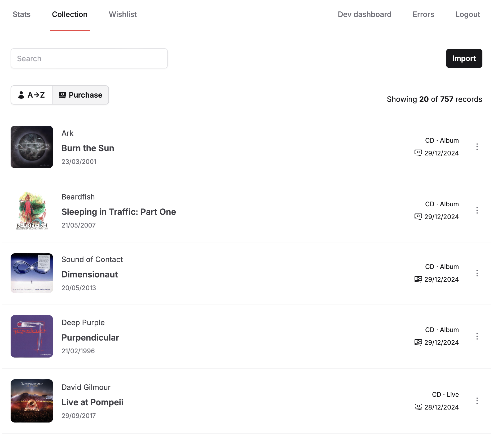
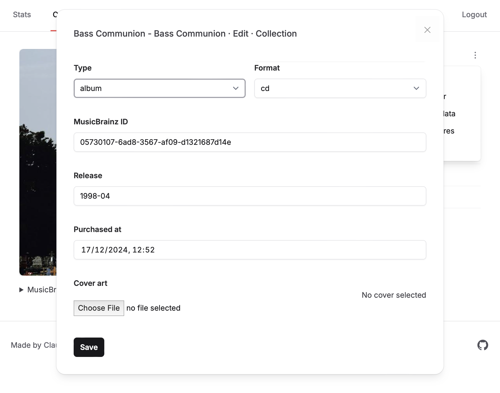
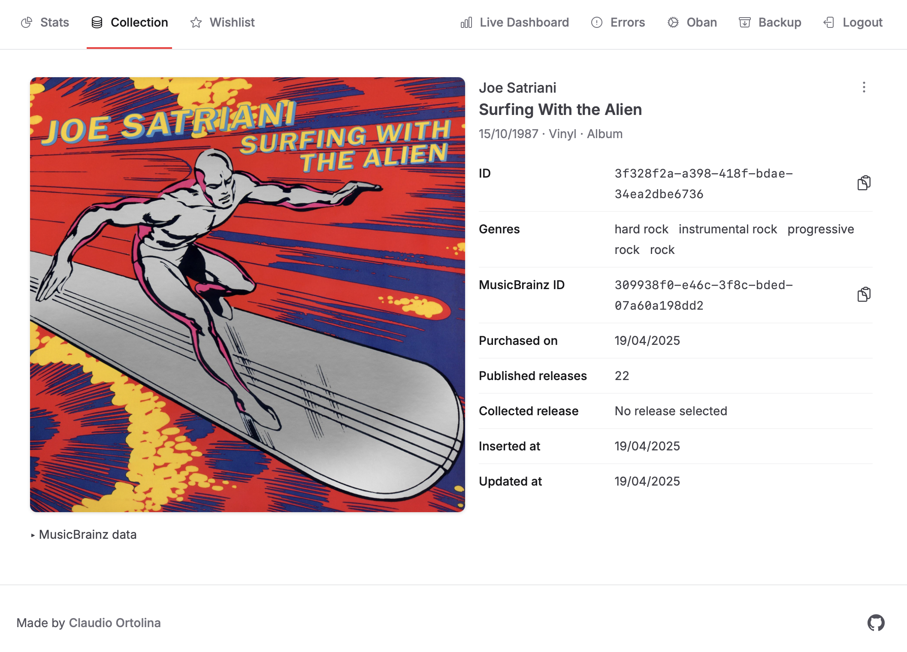
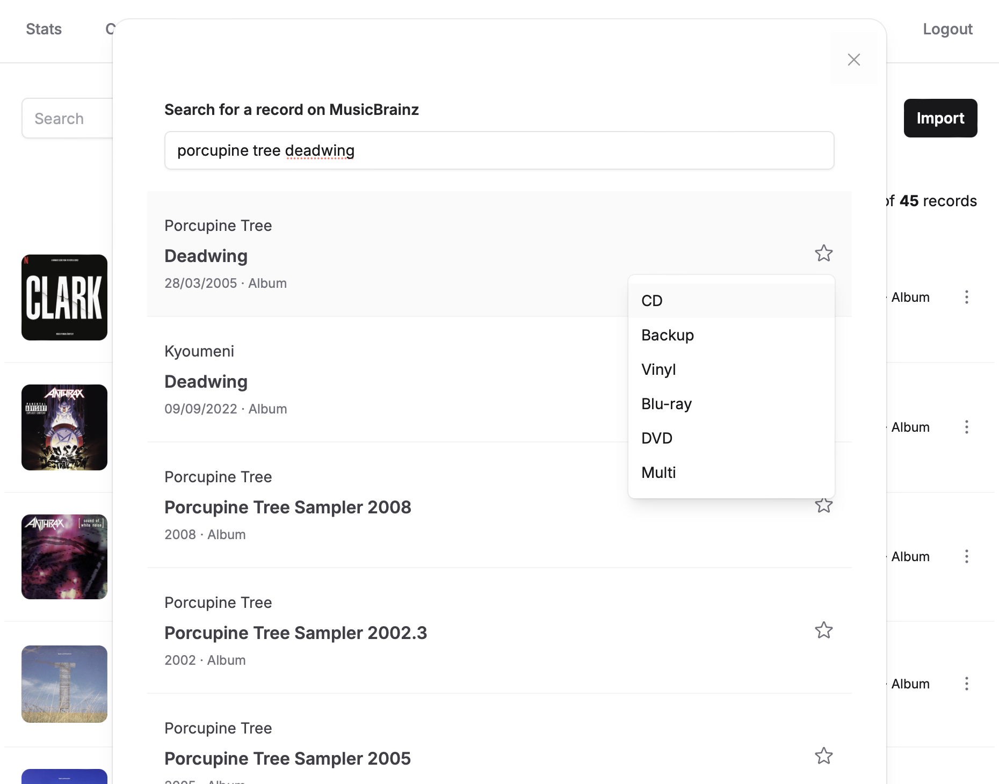
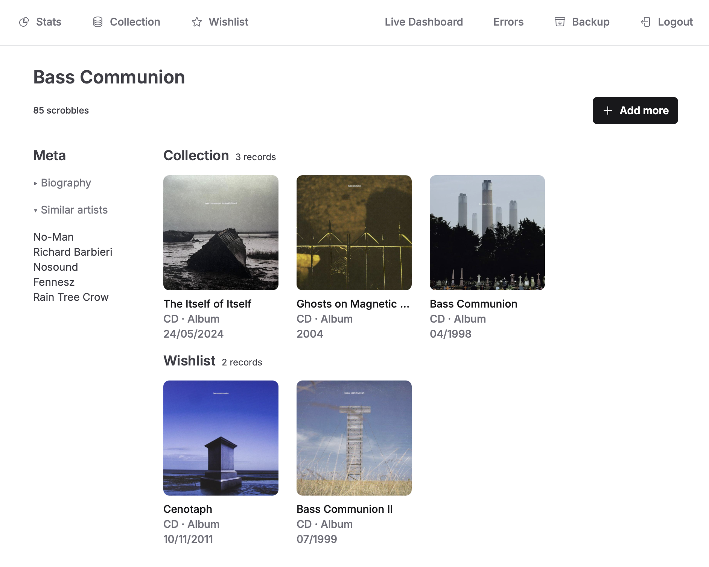

# Music Library

<!--toc:start-->

- [Music Library](#music-library)
  - [Features](#features)
  - [Screenshots](#screenshots)
    - [Stats](#stats)
    - [Collection](#collection)
    - [Edit a record in the collection](#edit-a-record-in-the-collection)
    - [View a record's details in the collection](#view-a-records-details-in-the-collection)
    - [Adding a record in the wishlist](#adding-a-record-in-the-wishlist)
    - [View an artist's details](#view-an-artists-details)
  - [Setup](#setup)
  - [Environment configuration](#environment-configuration)
  - [Running the application](#running-the-application)
  - [Deployment](#deployment)
  - [CI](#ci)
  - [Architecture](#architecture)
  - [Favicons](#favicons)
  <!--toc:end-->

## Features

- Add records from MusicBrainz, with optional override of specific pieces of data
- Manage a collection and a wishlist of records, with ways to quickly search
  and filter based on records' metadata
- Integration with Last.fm (display latest scrobbles, and where possible
  connect them with records in the collection or wishlist)
- Some basic stats
- All data stored in a single SQLite database for portability and ease of backup/restore
- Ideal for deployment on a server with limited resources (1CPU, 512MB RAM)

## Screenshots

### Stats

### Collection

### Edit a record in the collection

### View a record's details in the collection

### Adding a record in the wishlist

### View an artist's details

## Setup

The project is managed and configured via [mise-en-place](https://mise.jdx.dev):

- `mise install` will pull the correct Erlang, Elixir and Node.js versions
- `mise run dev:setup` will setup dependencies and database structure

> [!IMPORTANT]
> The project uses [Fluxon UI](https://fluxonui.com/), so it requires a valid
> set of credentials. See the `env` section in `mise.toml` for the required
> environment variables.

## Environment configuration

The application requires the following environment variables:

- `LAST_FM_USER`: the Last.fm username used to populate the Scrobble Activity
- `LAST_FM_API_KEY` (secret): the Last.fm API key used to fetch the Scrobble Activity
- `OPENAI_KEY` (secret): the OpenAI API key used to populating genres

In production, the application also requires:

- `LOGIN_PASSWORD` (secret): the password used for accessing the application.

You can create a `mise.local.toml` with the required variables (sample values
are included at the top of `mise.toml`).

## Running the application

Start the Phoenix endpoint with `mix phx.server` or inside IEx with
`iex -S mix phx.server`.

Now you can visit [`localhost:4000`](http://localhost:4000) from your browser.
The default password for development is `change me`.

## Deployment

The application is setup for deployment on Fly.io - just make sure you edit
`fly.toml` to match your app name, domain, etc.

## CI

See the `.github` folder.

## Architecture

See the `docs` folder.

## Favicons

This favicon was generated using the following graphics from Twitter Twemoji:

- Graphics Title: 1f4bd.svg
- Graphics Author: Copyright 2020 Twitter, Inc and other contributors (<https://github.com/twitter/twemoji>)
- Graphics Source: <https://github.com/twitter/twemoji/blob/master/assets/svg/1f4bd.svg>
- Graphics License: CC-BY 4.0 (<https://creativecommons.org/licenses/by/4.0/>)
