# Music Library

<!--toc:start-->

- [Music Library](#music-library)
  - [Features](#features)
  - [Screenshots](#screenshots)
    - [Stats dashboard](#stats-dashboard)
    - [Collection](#collection)
    - [Searching for a record to add](#searching-for-a-record-to-add)
    - [Record details](#record-details)
    - [Record releases](#record-releases)
    - [Record chat](#record-chat)
    - [Artist details](#artist-details)
    - [Wishlist record details](#wishlist-record-details)
    - [Record sets](#record-sets)
    - [Scrobble rules](#scrobble-rules)
    - [New scrobble rule](#new-scrobble-rule)
    - [Universal search](#universal-search)
  - [Setup](#setup)
  - [Environment configuration](#environment-configuration)
  - [Running the application](#running-the-application)
  - [Auditing Scrobble Data Quality](#auditing-scrobble-data-quality)
  - [Deployment](#deployment)
  - [CI](#ci)
  - [Architecture](#architecture)
  - [Favicons](#favicons)
  <!--toc:end-->

## Features

### Record management

- Add records from MusicBrainz, with optional override of specific pieces of data
- Cart-style multi-record import for adding several releases at once
- Manage a collection and a wishlist of records, with ways to quickly search
  and filter based on records' metadata (full-text search with structured query syntax:
  `artist:X`, `album:X`, `genre:"Y"`, `format:cd`, `type:album`, `purchase_year:2024`)
- Browse record releases and select a collected release
- Dominant color extraction from cover art
- Generate a 120mm×120mm PDF tracklist from record and release data

### AI chat

- AI-powered chat for records, artists, and the entire collection — with web search
  (OpenAI streaming via Responses API, entity-specific context for each chat type)

### Artists

- Artist details with biography, discography, and similar artists
- Markdown notes on records and artists

### Wishlist

- Wishlist with configurable online store templates for purchasing

### Record sets

- Curate record sets (e.g. "best live albums") with drag-and-drop ordering

### Search

- Universal search across collection, wishlist, artists, and record sets
- Similarity search via OpenAI embeddings (cosine-distance search with sqlite-vec)

### Last.fm integration

- Display latest scrobbles, and where possible connect them with records in the
  collection or wishlist
- Browse and search the complete scrobble history
- Scrobble a record directly
- Store a local copy of the complete scrobble history, and setup scrobble rules
  to fix data quality issues (missing MusicBrainz IDs, artist/album remapping)
- Audit scrobble data quality via mix task: identify tracks with missing
  MusicBrainz IDs for artists and albums

### Import & scanning

- Barcode scanning for quick imports (barcode → MusicBrainz lookup)

### Stats & maintenance

- Stats dashboard with collection overview, top artists, top albums, and
  records on this day
- Daily email digest: "records on this day" with cover images and anniversary styling
- Admin maintenance dashboard: batch metadata/embedding refresh, database
  vacuum/optimize, Last.fm connection status

### Infrastructure

- All data stored in SQLite databases for portability and ease of backup/restore

## Screenshots

### Stats dashboard

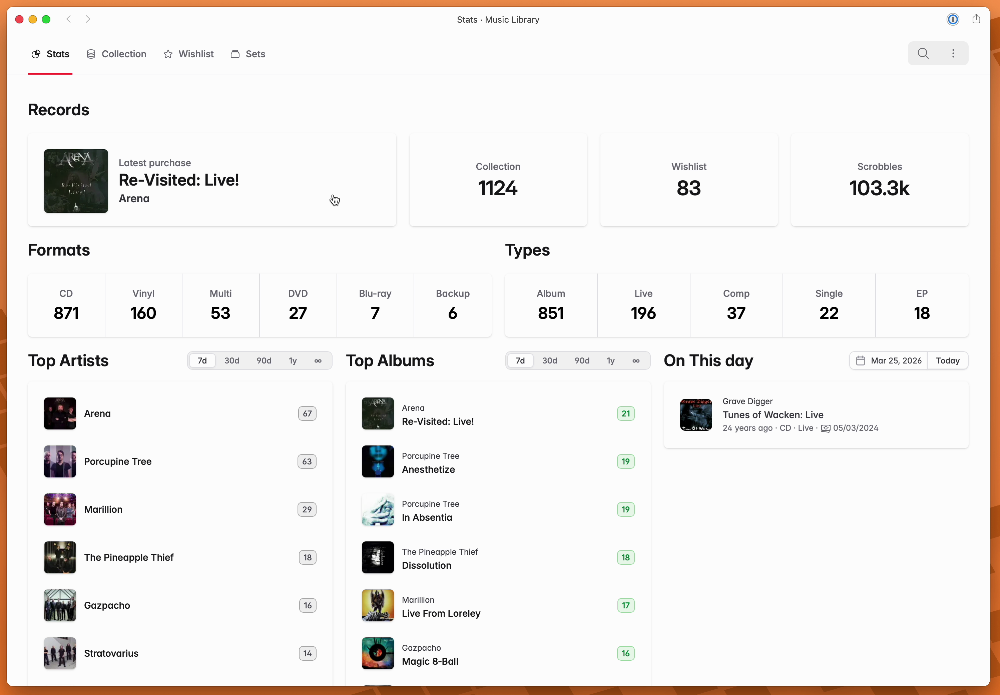

### Collection

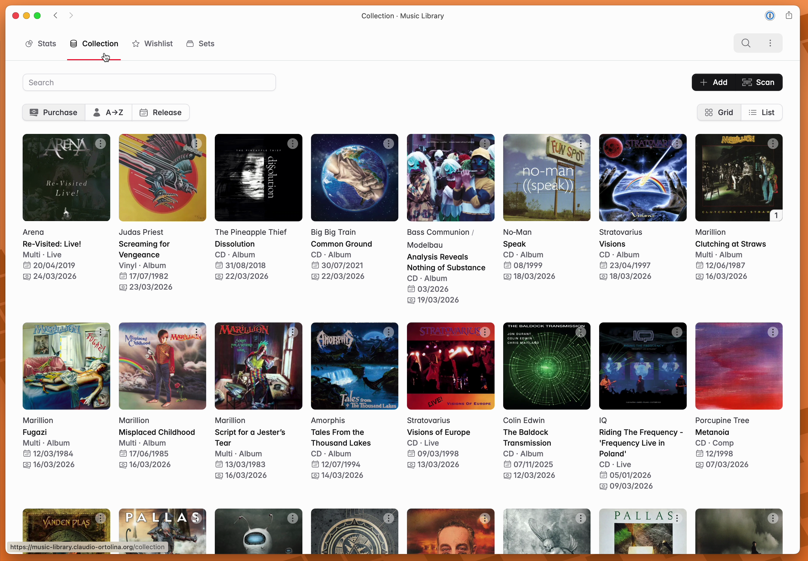

### Searching for a record to add

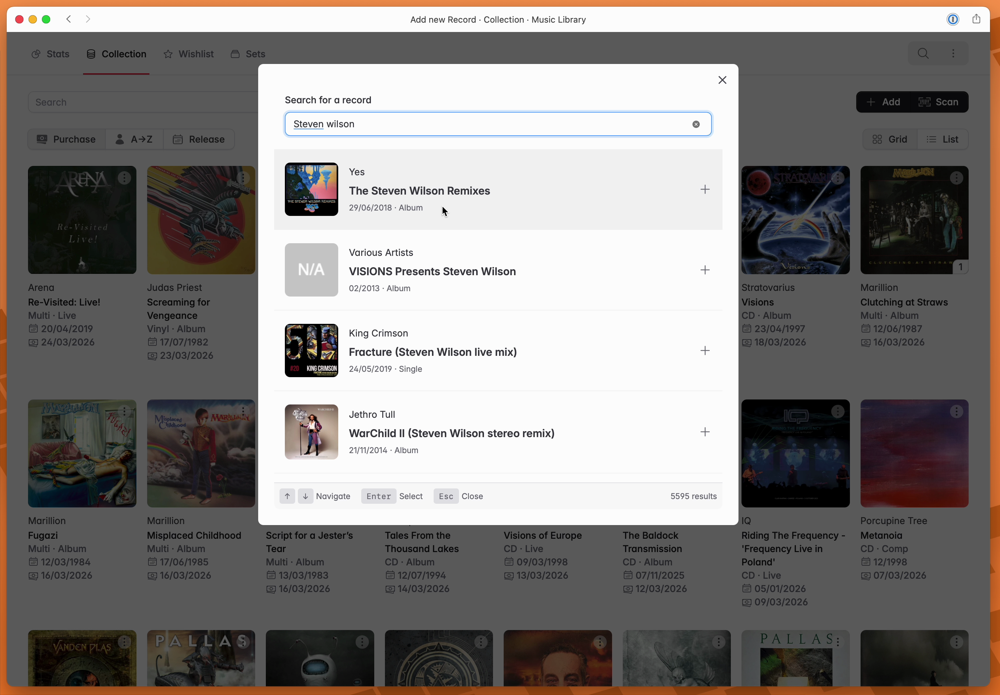

### Record details

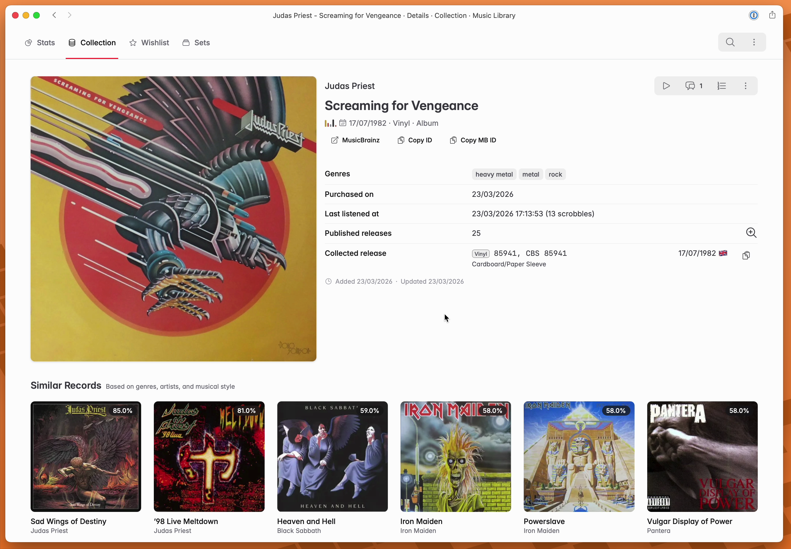

### Record releases

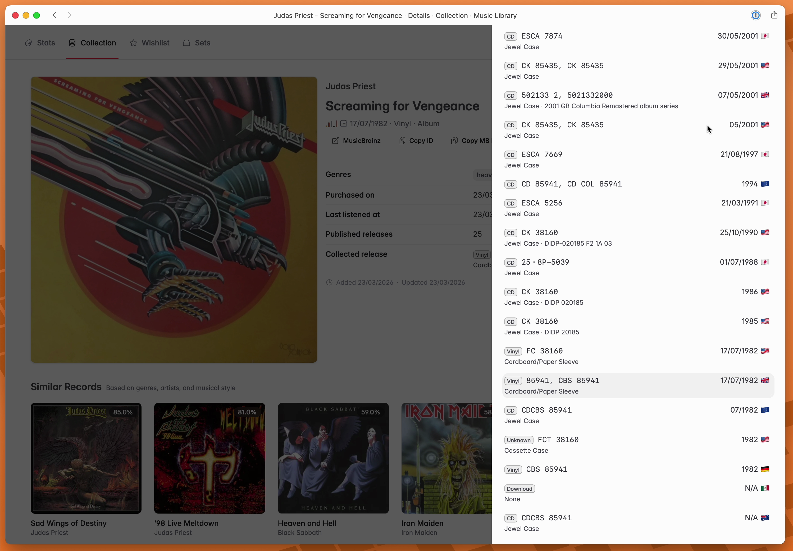

### Record chat

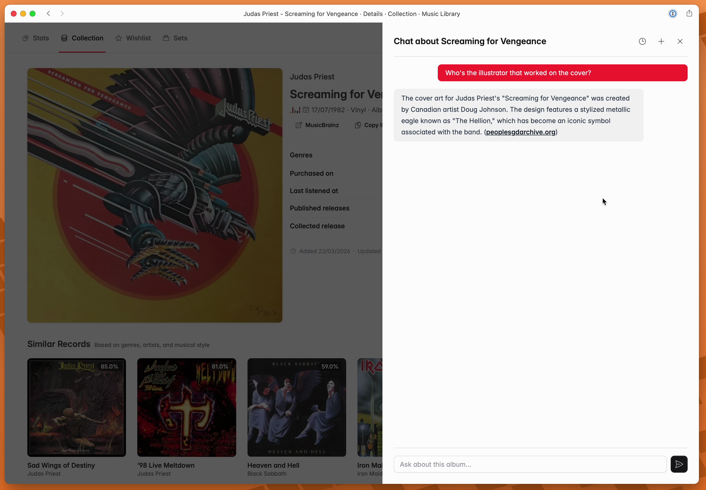

### Artist details

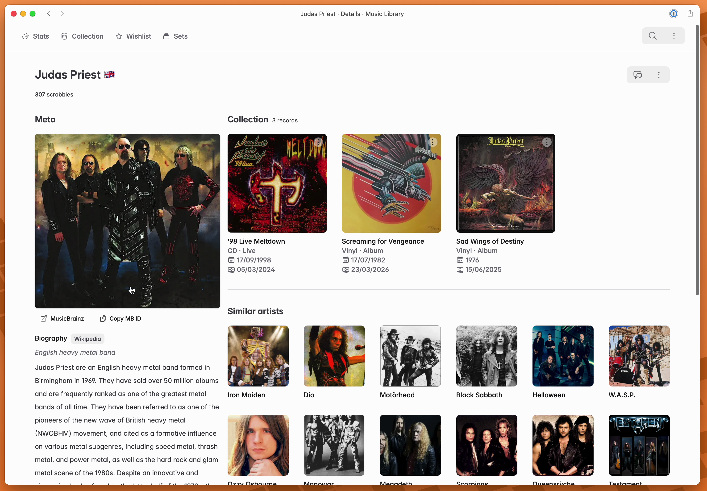

### Wishlist record details

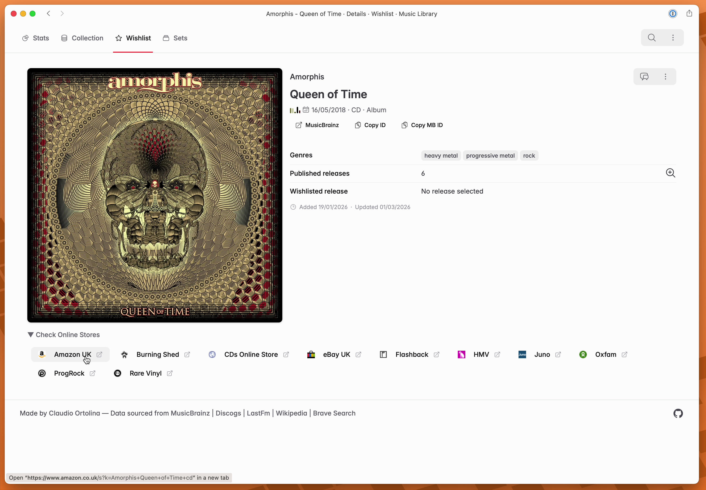

### Record sets

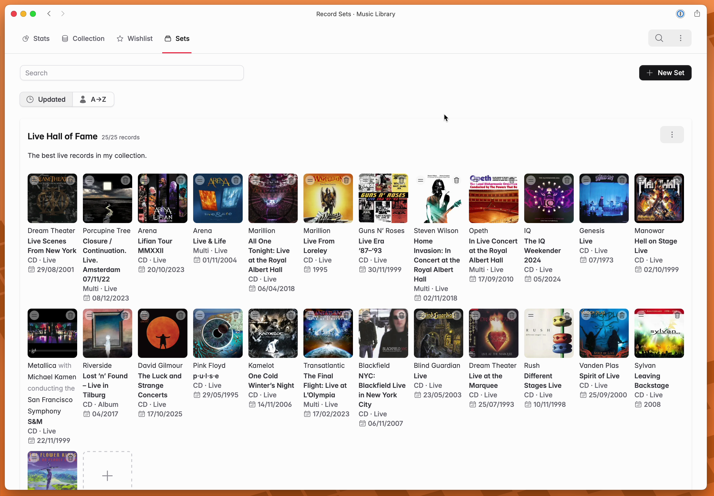

### Scrobble rules

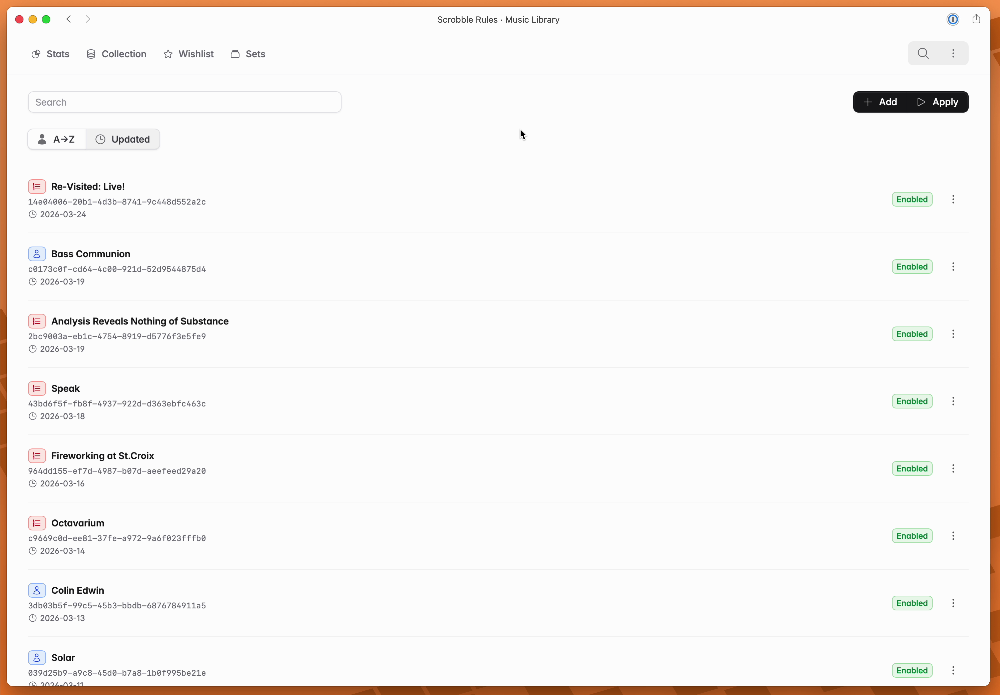

### New scrobble rule

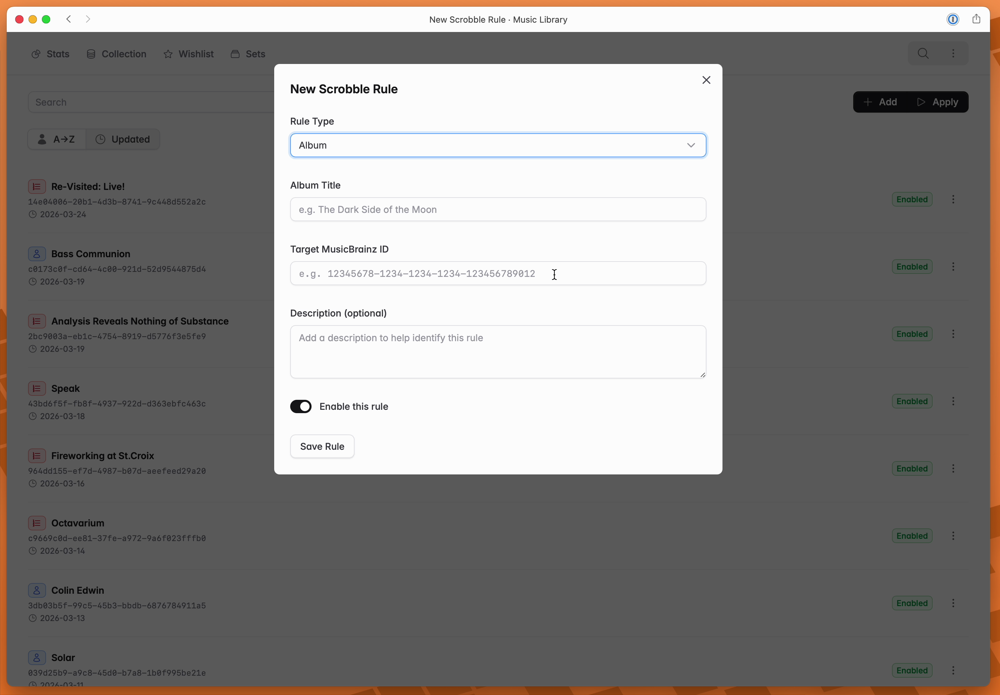

### Universal search

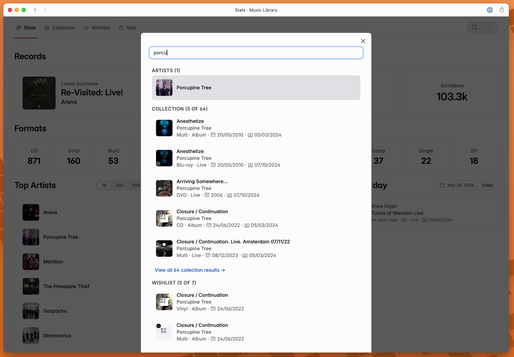

## Setup

The project is managed and configured via [mise-en-place](https://mise.jdx.dev):

- `mise install` will pull the correct Erlang, Elixir and Node.js versions
- `mise run dev:setup` will setup dependencies and database structure

> [!IMPORTANT]
> The project uses [Fluxon UI](https://fluxonui.com/), so it requires a valid
> set of credentials. See the `env` section in `mise.toml` for the required
> environment variables.

It's recommended to use the git hooks included in the project. Install with:

`mise generate git-pre-commit --write --task=dev:precommit`

## Environment configuration

Required environment variables for development are listed in `mise.toml`.

You can create a `mise.local.toml` with the required variables (sample values
are included at the top of `mise.toml`).

For production, please see `compose.yaml` for a list of required variables.

## Running the application

Start the Phoenix endpoint with `mise run console` (along with an attached IEx session).

## Auditing Scrobble Data Quality

The application includes a Mix task to audit scrobbled tracks and identify data quality issues such as missing MusicBrainz IDs for artists and albums.

### Running the Audit

```bash
# Audit all tracks
mix scrobble.audit

# Audit with detailed output including sample tracks
mix scrobble.audit --verbose

# Audit only artist issues
mix scrobble.audit --type artist

# Audit only album issues
mix scrobble.audit --type album

# Output as JSON for processing
mix scrobble.audit --format json
```

### Understanding the Audit Report

The audit report shows:

- Total number of scrobbled tracks
- Artists with missing MusicBrainz IDs (grouped by artist name)
- Albums with missing MusicBrainz IDs (grouped by album title and artist)
- Track counts for each issue

### Fixing Data Quality Issues

After identifying issues, you can:

1. **Create Scrobble Rules**: Navigate to the Scrobble Rules page in the web interface and add rules to map artist or album names to their correct MusicBrainz IDs.

2. **Apply Rules**: Use the "Apply Rules" button in the Scrobble Rules page to update existing tracks, or run in IEx:

   ```elixir
   MusicLibrary.ScrobbleRules.apply_all_rules()
   ```

3. **Re-audit**: Run the audit again to verify the fixes worked.

The application also provides helper functions in the `MusicLibrary.ScrobbleActivity` context:

- `count_tracks_missing_artist_musicbrainz_id/0`
- `count_tracks_missing_album_musicbrainz_id/0`
- `get_artists_missing_musicbrainz_id/1`
- `get_albums_missing_musicbrainz_id/1`

## Deployment

The application is deployed via Coolify, using a Docker Compose strategy.

## CI

See the `.github` folder.

## Architecture

See the `docs` folder.

## Favicons

This favicon was generated using the following graphics from Twitter Twemoji:

- Graphics Title: 1f4bd.svg
- Graphics Author: Copyright 2020 Twitter, Inc and other contributors (<https://github.com/twitter/twemoji>)
- Graphics Source: <https://github.com/twitter/twemoji/blob/master/assets/svg/1f4bd.svg>
- Graphics License: CC-BY 4.0 (<https://creativecommons.org/licenses/by/4.0/>)
