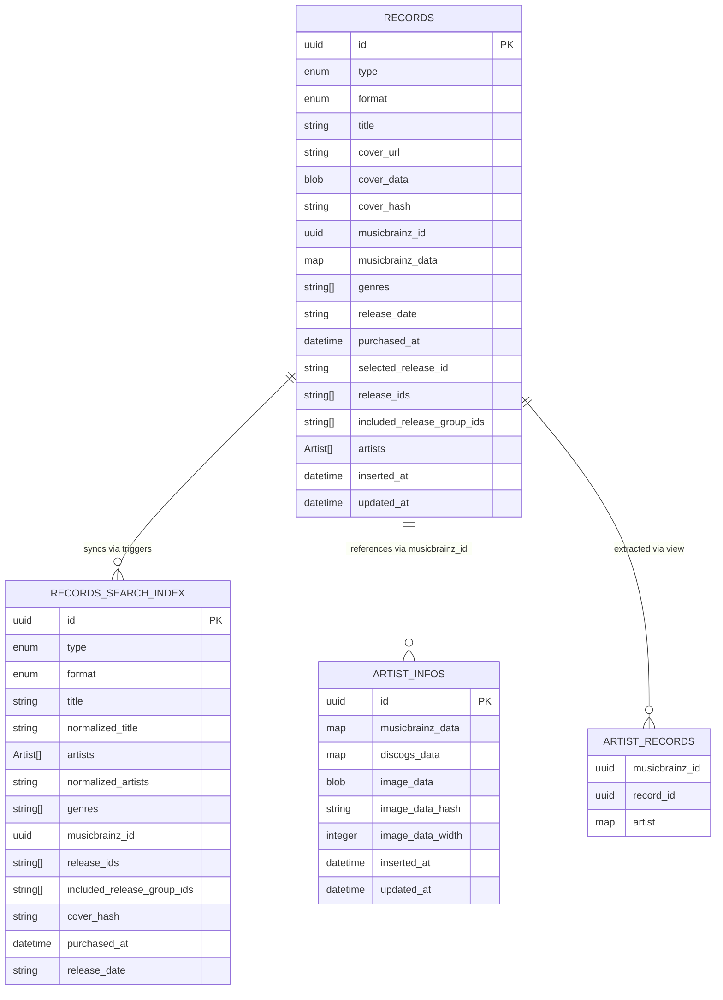

# Database Structure

<!--toc:start-->

- [Database Structure](#database-structure)
  - [Entity Relationship Diagram](#entity-relationship-diagram)
  - [Tables Description](#tables-description)
    - [Records](#records)
    - [Records Search Index](#records-search-index)
    - [Artist Infos](#artist-infos)
    - [Views](#views)
      - [Artist Records View](#artist-records-view)
    - [Triggers](#triggers)
    - [Indices](#indices)
  - [Notes](#notes)
  - [WHY ONE TABLE?](#why-one-table)
  <!--toc:end-->

This document describes the database structure of the Music Library application.

## Entity Relationship Diagram



## Tables Description

### Records

The main table storing music records. Key features:

- Uses UUID as primary key
- Stores basic record information (title, type [album, ep, live, compilation, single, other], format [cd, backup, vinyl, blu_ray, dvd, multi])
- Includes MusicBrainz integration with IDs and additional data (musicbrainz_id, musicbrainz_data)
- Stores cover image data and URLs (cover_url, cover_data, cover_hash)
- Embeds artists data as an array of objects (each with musicbrainz_id, name, sort_name, disambiguation)
- Includes timestamps for record keeping
- Tracks purchase status via `purchased_at` field
- Stores release information including multiple release IDs (`release_ids`), included release group IDs (`included_release_group_ids`), and a selected release ID (`selected_release_id`)
- Maintains release date information (`release_date`)

### Records Search Index

A virtual FTS5 (Full Text Search) table that mirrors the records table for efficient searching:

- Automatically synced with the records table via triggers
- Optimized for full-text search operations
- Contains most fields from the records table, including:
  - id, type, format, title, normalized_title, artists, normalized_artists, genres, musicbrainz_id, release_ids, included_release_group_ids, cover_hash, purchased_at, release_date
- `normalized_title` and `normalized_artists` are unaccented versions for improved search
- Some fields are marked as UNINDEXED for efficiency

### Artist Infos

A table that stores additional artist information:

- Uses UUID as primary key
- Stores MusicBrainz and Discogs data for artists
- Maintains artist image data with dimensions and hash
- Includes timestamps for record keeping

### Views

#### Artist Records View

A view that extracts artist information from the embedded JSON in the records table:

```sql
CREATE VIEW artist_records AS
  SELECT json_extract(json_each.value, '$.musicbrainz_id') AS musicbrainz_id,
  records.id AS record_id,
  json_each.value as artist
  FROM records,
  json_each(records.artists)
```

This view is crucial for querying artist information as it:
- Extracts individual artists from the embedded JSON array in the records table
- Provides a normalized view of the artist-record relationships
- Makes it easier to query records by artist
- Maintains the relationship between records and their artists without requiring a separate join table

### Triggers

The following triggers maintain the search index:

1. `records_after_insert`: Inserts new record data into search index after record creation
2. `records_after_update`: Updates record data in search index after record updates

### Indices

The following indices are maintained for performance:

1. On `records`:
   - `type`
   - `format`
   - `title`
   - `musicbrainz_id`
   - `purchased_at`
   - `included_release_group_ids`
   - `release_ids`

## Notes

1. The database uses SQLite as the primary database.
2. Artists data is embedded directly in the records table as an array of objects, not a separate table.
3. The search index is implemented using SQLite's FTS5 extension for efficient full-text search capabilities, with normalized (unaccented) fields for better search.
4. Where needed, queries use SQLite's `unicode` extension to filter/sort over UTF-8 data.
5. The database supports both collection and wishlist functionality through the `purchased_at` field:
   - Records with `purchased_at IS NOT NULL` are in the collection
   - Records with `purchased_at IS NULL` are in the wishlist
6. The schema uses `release_date` for clarity
7. The `selected_release_id` field tracks the primary release for a record
8. The `artist_infos` table stores additional artist metadata and images
9. The `artist_records` view provides a normalized way to query artist-record relationships

## WHY ONE TABLE?

In traditional relational database design, you would split out artists into a
separate table, and associate them with records via a join table. So why
sticking with one table?

1. You only need to backup/export one table.
2. Re-fetching data from MusicBrainz becomes trivial, as it just needs to update one field and everything else cascades accordingly.
3. Traditional efficiency design constraints [do not apply to
   SQLite](https://www.sqlite.org/np1queryprob.html), so it makes it easier to experiment with alternative database designs.
